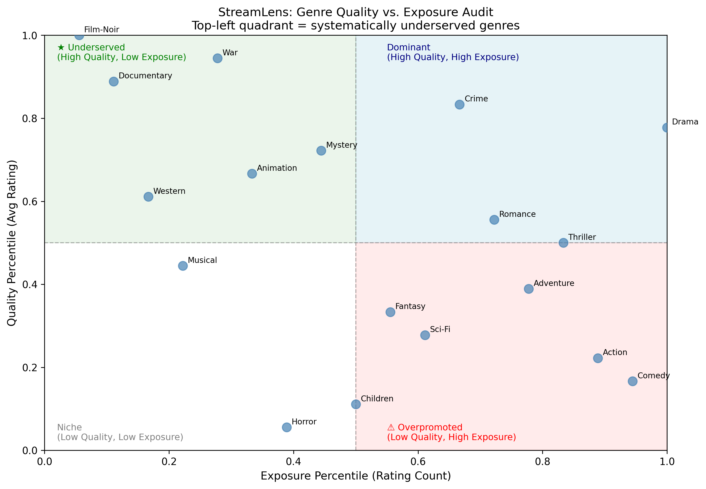
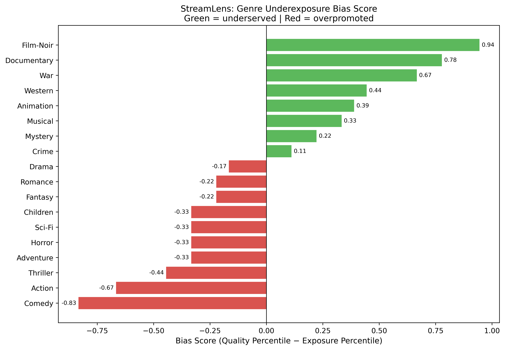

# StreamLens — Genre Fairness Audit for Streaming Recommendations

> Streaming platforms over-recommend popular content while systematically burying high-quality niche films. StreamLens quantifies this bias across genres and proposes data-driven interventions to fix it.

[](https://streamlens.streamlit.app)
[](https://github.com/xinyacheng716/StreamLens)
* Note: This dashboard is hosted on Streamlit Community loud. If you see a loading screen, please wait about 60 sec for the app to wake up.*


---

## The Problem

If you watch foreign films or documentaries, you have probably noticed that your streaming platform rarely surfaces them — even when they have strong reviews. Meanwhile, mainstream comedies and action films dominate the homepage regardless of their rating.

This is not a coincidence. Recommendation algorithms optimise for engagement volume, which means genres with large audiences get more exposure, regardless of quality. High-quality niche content gets trapped in a low-visibility cycle: less exposure leads to fewer ratings, which leads to even less exposure.

StreamLens investigates whether this pattern is systemic and measurable — and if so, what a platform can do about it.

---

## Key Findings

**Dataset: MovieLens ml-latest — 33.8 million ratings across 86,537 films**

### 1. Quality and exposure move in opposite directions

Across 18 genres, higher average rating is associated with lower rating volume (Pearson r = −0.266). The genres rated best by users are not the genres the platform surfaces most.



*Each point is a genre. Top-left quadrant = high quality, low exposure — systematically underserved.*

### 2. The gap is largest for Film-Noir, Documentary, and War

Bias Score measures the gap between a genre's quality rank and its exposure rank. A score of +0.94 for Film-Noir means its quality percentile is 94 points higher than its exposure percentile.

| Genre | Bias Score | Interpretation |
|-------|-----------|----------------|
| Film-Noir | +0.94 | Most underserved |
| Documentary | +0.78 | Severely underserved |
| War | +0.67 | Severely underserved |
| Comedy | −0.78 | Most overpromoted |
| Action | −0.67 | Overpromoted |



### 3. At the film level, quality predicts underexposure more than genre

A Random Forest model (accuracy: 86.1%, underserved recall: 88%) found that `avg_rating` accounts for 88% of predictive power, with genre features contributing only 12%. This means genre-based curation alone is insufficient — the strongest signal for which films are being buried is their rating.

---

## Business Recommendations

Three interventions, ordered by implementation complexity:

**Intervention 1 — Film-Level Algorithmic Trigger**
Flag films meeting both conditions: `avg_rating >= 3.8` AND `rating_count <= 60`. These thresholds are data-justified: 3.8 is above the mean rating of underserved films (3.77); 60 is the median rating count of underserved films, where suppression signal is strongest. This identifies 831 high-quality suppressed films as boost candidates.

**Intervention 2 — Quarterly Genre Fairness Audit**
Run a Bias Score analysis every quarter. Flag genres with `bias_score > 0.3` for editorial review. The 0.3 threshold reflects a natural break in the data between Animation (+0.33) and Mystery (+0.28). Five genres currently qualify: Film-Noir, Documentary, War, Animation, and Western.

**Intervention 3 — Human-in-the-Loop Editorial Layer**
Algorithmic detection surfaces candidates; an editorial team makes final decisions before any boost goes live. Rationale: every algorithm has blind spots, and fixing one bias can introduce another. `rating_count` cannot fully separate algorithmic suppression from genuinely small audiences — human judgment bridges that gap.

---

## How It Works

### Analytical Pipeline

```
Raw Data (MovieLens ml-latest)
    └── Phase 1: Data Cleaning + Genre Aggregation
            Remove IMAX / no-genre entries (1.6M rows removed)
            Explode multi-genre rows → genre-level rating stats
    └── Phase 2: Bias Quantification
            Calculate avg_rating and rating_count per genre
            Normalise to percentile ranks (0–1)
            Bias Score = Quality Percentile − Exposure Percentile
            Pearson correlation test across genres
    └── Phase 3: ML Layer (Film-Level)
            Feature engineering: avg_rating, rating_count, genre dummies
            Logistic Regression vs Random Forest comparison
            Feature importance analysis
    └── Phase 4: Dashboard + Business Recommendations
            Streamlit interactive dashboard
            Three data-justified interventions
```

### Key Methodological Decisions

**Why rating_count as exposure proxy?**
Real platform data (impressions, CTR, recommendation logs) is not publicly available. Rating count is a reasonable but imperfect proxy — it reflects a mix of algorithmic exposure, organic search, and audience size. Findings should be interpreted as correlation patterns, not confirmed causal attribution.

**Why switch from ml-latest-small to ml-latest?**
The small dataset had a rating_count median of 1 for underserved films, making avg_rating statistically unreliable (Central Limit Theorem requires n ≥ 30). The full dataset, with a rating_count ≥ 30 filter, yields 1,662 statistically valid underserved films.

**Why explode multi-genre rows instead of fractional counting?**
Fractional counting penalises genres that co-occur frequently with others, shrinking the quality-exposure gap for niche genres and weakening the analysis signal. Exploding preserves relative exposure differences across genres consistently.

**Why effect size instead of significance testing?**
With 33.8 million ratings, almost all differences become statistically significant — significance testing loses discriminating power at this scale. Bias Score (effect size) is more informative.

---

## Technical Stack

| Layer | Tools |
|-------|-------|
| Language | Python 3 |
| Data manipulation | Pandas, NumPy |
| Visualisation | Matplotlib, Seaborn |
| Machine learning | scikit-learn (Logistic Regression, Random Forest) |
| Dashboard | Streamlit |
| Dataset | MovieLens ml-latest (GroupLens, University of Minnesota) |
| Version control | Git / GitHub |

---

## Project Structure

```
StreamLens/
├── data/
│   ├── raw/                    # Original MovieLens files (not tracked by git)
│   └── processed/
│       ├── genre_summary.csv   # Genre-level aggregated stats
│       └── film_underserved.csv# 1,662 underserved films (rating_count ≥ 30)
├── notebooks/
│   ├── phase1_cleaning.ipynb   # Data cleaning + genre aggregation
│   ├── phase2_bias_analysis.ipynb  # Bias Score analysis + visualisation
│   └── phase3_ML.ipynb         # Logistic Regression + Random Forest
├── outputs/
│   └── figures/
│       ├── phase2_bias_score.png
│       ├── phase2_quadrant.png
│       ├── phase2_correlation.png
│       └── phase3_feature_importance.png
├── streamlit_app/
│   └── app.py                  # Dashboard (all 6 sections)
└── README.md
```

---

## How to Run Locally

**Prerequisites:** Python 3.8+, pip

```bash
# Clone the repository
git clone https://github.com/xinyacheng716/StreamLens.git
cd StreamLens

# Install dependencies
pip install pandas numpy matplotlib seaborn scikit-learn streamlit

# Download MovieLens ml-latest dataset
# https://grouplens.org/datasets/movielens/latest/
# Place ml-latest/ folder inside data/raw/

# Run notebooks in order
# notebooks/phase1_cleaning.ipynb
# notebooks/phase2_bias_analysis.ipynb
# notebooks/phase3_ML.ipynb

# Launch dashboard
streamlit run streamlit_app/app.py
```

---

## Limitations

**Exposure proxy:** `rating_count` reflects a mix of algorithmic recommendations, organic audience search, and historical content volume. The negative correlation (r = −0.266) and Bias Scores cannot be attributed solely to algorithmic bias. Film-Noir's +0.94 gap is large enough that audience size alone is unlikely to fully explain it, but the alternative cannot be ruled out.

**avg_rating structural dominance:** The 88% feature importance of `avg_rating` partially reflects its direct mathematical link to the `is_underserved` label definition, not only external causal factors.

**Dataset recency:** MovieLens ml-latest has a cutoff date and does not reflect current streaming platform algorithm behaviour.

**Future work:** Replace `rating_count` with real platform data — impression count, click-through rate (CTR), and completion rate — to disentangle algorithmic suppression from organic audience size.

---

## About

Built by **Sophie Cheng (Xin-Ya Cheng)** as a portfolio project for BA / DA / AI PM roles in tech and entertainment.

- Background: Economics & Foreign Literature, National Taiwan University (GPA 3.91). Exchange at Singapore Management University.
- Starting Columbia MSBA, August 2026.
- Previous experience: Klook (Platform Operations, SQL + A/B testing), Eastspring Investment, Porsche Taiwan.

*Motivated by personal experience: as an arthouse film viewer, I noticed that high-quality niche content rarely surfaces on streaming platforms. This project validates whether that experience reflects a measurable systemic pattern.*

---

*Dataset: F. Maxwell Harper and Joseph A. Konstan. 2015. The MovieLens Datasets: History and Context. ACM Transactions on Interactive Intelligent Systems, 5(4).*